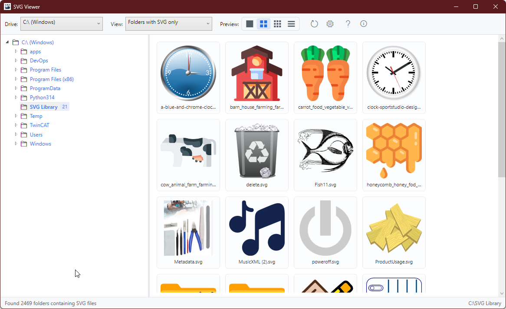
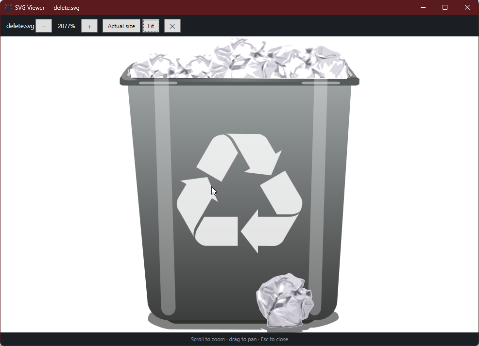

# SVGViewer

A Windows desktop application (C# / WPF, .NET 8) to **browse a drive, find SVG
files fast, and preview them** — with folders that contain SVGs clearly marked,
adjustable preview sizes, and one double‑click to open a file in your associated
editor (e.g. Inkscape). The interface is fully multilingual (Dutch, English,
German).

## Features

- **Drive & folder navigation** — pick a drive and click through a tree view.
- **SVG folder highlighting** — folders that contain `.svg` files are marked so
  you can jump straight to them.
- **Structure filter** — show the full folder tree, or only folders that contain
  SVG files.
- **Preview sizes** — Large, Medium, Small, or Only details (list view).
- **SVG‑only** — all non‑SVG files are hidden.
- **Edit externally** — double‑click an SVG to open it in the associated app.
- **Multilingual UI** — Dutch (default), English, German, switchable at runtime.
- **In‑app help** — user guide opens in the currently selected language.

## Screenshots

Main window:



Preview window (zoom & pan):



## Tech stack

| Area | Choice |
|------|--------|
| Framework | .NET 8 (`net8.0-windows`), WPF |
| Pattern | MVVM (`CommunityToolkit.Mvvm`) |
| SVG rendering | `SharpVectors.Reloaded` |
| Optional UI | Syncfusion WPF (license read from a local file) |
| Localization | `.resx` satellite assemblies (nl / en / de) |

## Getting started

```powershell
# Requires the .NET 8 SDK (pinned via global.json)
git clone https://github.com/hnsoftwaredevelopment/SVGViewer.git
cd SVGViewer
dotnet build -c Release
dotnet run --project src/SVGViewer
```

### Syncfusion license (optional)

If you use the Syncfusion controls, place your license key in a file named
`syncfusionlicense.txt` inside `src/SVGViewer/`. This file is **git‑ignored** and
is never committed. If the file is absent, the app still runs (with a Syncfusion
trial notice) or falls back to the standard WPF controls.

## Documentation

- Quick reference: [`docs/user-guide/`](docs/user-guide/) — a short overview in NL / EN / DE (also opened by the in‑app Help button).
- Design & planning: [`docs/Epic.md`](docs/Epic.md) and
  [`docs/UserStories.md`](docs/UserStories.md).

## License

© HN Software Development. All rights reserved.
