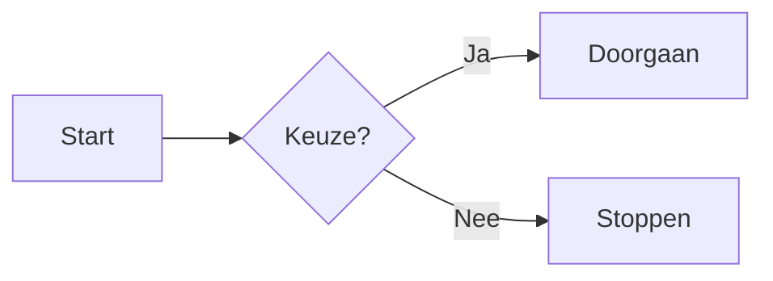
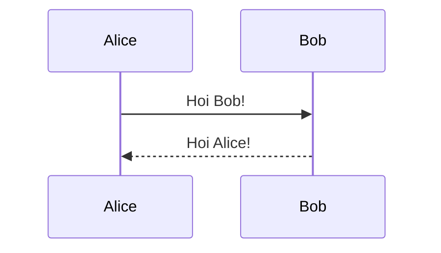

```insta-toc
---
title:
  name:
  level:
  center:
exclude:
style:
  listType:
omit:
levels:
  min:
  max:
---

# Inhoudsopgave

- Standaard Markdown
    - Koppen
    - Tekstopmaak
    - Lijsten
    - Koppelingen & afbeeldingen
    - Blokcitaten
    - Codeblokken
    - Tabellen (GFM)
    - Taakoverzichten / Checklists (GFM)
    - Horizontale lijn
    - Escape-tekens
- Obsidian-eigen syntaxis
    - Wikilinks (interne koppelingen)
    - Insluiten (Embeds)
    - Markeringen (Highlights)
    - Callouts (gestileerde blokken)
    - Blokreferenties
    - Tags
    - Wiskundige formules (LaTeX via MathJax)
    - Diagrammen (Mermaid)
    - Voetnoten
    - Verborgen opmerkingen
    - Inline HTML
    - YAML Frontmatter
- Populaire (core) plugins
    - Templates
    - Dataview (community plugin — zeer populair)
- Sneltoetsen (standaard)
- Compatibiliteitsoverzicht
- Meer informatie
```

----
## Standaard Markdown
_Werkt in vrijwel elke Markdown-editor._

### Koppen

markdown

```markdown
# Kop 1
## Kop 2
### Kop 3
#### Kop 4
##### Kop 5
###### Kop 6
```

> ⚠️ Let op: `#tekst` zonder spatie is een **tag** in Obsidian, geen kop!

---

### Tekstopmaak

|Opmaak|Syntaxis|Resultaat|
|---|---|---|
|Vet|`**vet**`|**vet**|
|Cursief|`*cursief*`|_cursief_|
|Vet + cursief|`***vet en cursief***`|_**vet en cursief**_|
|Doorgestreept|`~~doorgestreept~~`|~~doorgestreept~~|
|Inline code|`` `code` ``|`code`|
|Regelafbreking|twee spaties aan het einde of `\`|harde regelafbreking|

---

### Lijsten

markdown

```markdown
- Ongeordend item
- Nog een item
    - Genest item (4 spaties of tab)

1. Eerste
2. Tweede
3. Derde
```

---

### Koppelingen & afbeeldingen

markdown

```markdown
[Linktekst](https://obsidian.md)

```

---

### Blokcitaten

markdown

```markdown
> Dit is een blokcitaat.
> Het kan meerdere regels bevatten.
```

---

### Codeblokken

Gebruik drie backticks met een taalidentificatie voor syntaxiskleuring:

markdown

````markdown
```python
def groet(naam):
    return f"Hallo, {naam}!"
```
````

Ondersteunde talen: `python`, `js`, `ts`, `html`, `css`, `bash`, `sql`, `json`, `yaml`, `java`, `csharp`, `rust`, `go`, en vele anderen.

---

### Tabellen (GFM)

markdown

```markdown
| Kolom A    | Kolom B      | Kolom C  |
| :--------- | :----------: | -------: |
| Links       | Gecentreerd  | Rechts   |
| Waarde 1   | Waarde 2     | Waarde 3 |
```

`:---` = links · `:---:` = gecentreerd · `---:` = rechts

---

### Taakoverzichten / Checklists (GFM)

markdown

```markdown
- [ ] Openstaande taak
- [x] Afgeronde taak
- [ ] Nog een taak
```

---

### Horizontale lijn

markdown

```markdown
---
```

---

### Escape-tekens

markdown

```markdown
\*niet cursief\*
\# geen kop
\[[geen wikilink\]]
```

---

## Obsidian-eigen syntaxis

_Werkt alleen in Obsidian. In andere editors verschijnt dit als platte tekst._

---

### Wikilinks (interne koppelingen)

markdown

```markdown
[[Notitietitel]]
[[Notitietitel|Weergavetekst]]
[[Notitietitel#Kopje]]
[[Notitietitel#^blok-id]]
```

|Syntaxis|Betekenis|
|---|---|
|`[[Notitie]]`|Koppelt aan een andere notitie in je vault|
|`[[Notitie\|Alias]]`|Koppelt met aangepaste weergavetekst|
|`[[Notitie#Kopje]]`|Koppelt direct naar een sectie|
|`[[Notitie#^blok-id]]`|Koppelt naar een specifiek blok|

---

### Insluiten (Embeds)

Zet een `!` voor een wikilink om de inhoud inline te tonen:

markdown

```markdown
![[Andere notitie]]
![[Andere notitie#Kopje]]
![[Andere notitie#^blok-id]]
![[afbeelding.png]]
![[afbeelding.png|300]]
![[document.pdf]]
![[audio.mp3]]
```

---

### Markeringen (Highlights)

markdown

```markdown
==gemarkeerde tekst==
```

---

### Callouts (gestileerde blokken)

markdown

```markdown
> [!note]
> Dit is een notitietype callout.

> [!tip] Aangepaste titel
> Je kunt de titel aanpassen.

> [!warning]- Klik om uit te vouwen
> Standaard ingeklapt (gebruik `-`).

> [!info]+
> Standaard uitgeklapt (gebruik `+`).
```

**Beschikbare callout-typen:**

|Type|Kleur|Gebruik|
|---|---|---|
|`note`|Blauw|Algemene notities|
|`abstract`|Blauw|Samenvattingen|
|`info`|Blauw|Informatieve tekst|
|`tip`|Groen|Handige tips|
|`success`|Groen|Resultaten, bevestigingen|
|`question`|Geel|Openstaande vragen|
|`warning`|Oranje|Waarschuwingen|
|`failure`|Rood|Fouten, mislukkingen|
|`danger`|Rood|Kritieke waarschuwingen|
|`bug`|Rood|Bugs, problemen|
|`example`|Paars|Voorbeelden|
|`quote`|Grijs|Citaten|

---

### Blokreferenties

Geef een alinea een uniek ID om er van elders naar te verwijzen:

markdown

```markdown
Dit is een alinea die ik elders wil citeren. ^mijn-blok-id
```

markdown

```markdown
<!-- In een andere notitie: -->
[[DitBestand#^mijn-blok-id]]
![[DitBestand#^mijn-blok-id]]
```

---

### Tags

markdown

```markdown
#project
#project/actief
#status/in-behandeling
#2026/Q2
```

- Geneste tags maak je met `/`
- `#tekst` zonder spatie = tag
- `# tekst` met spatie = Kop 1

---

### Wiskundige formules (LaTeX via MathJax)

markdown

```markdown
Inline formule: $E = mc^2$
```

markdown

```markdown
$$
\int_0^1 x^2 \, dx = \frac{1}{3}
$$
```

---

### Diagrammen (Mermaid)

markdown

````markdown

````

markdown

````markdown

````

Ondersteunde diagramtypen: `flowchart`, `sequenceDiagram`, `gantt`, `classDiagram`, `stateDiagram`, `pie`, `erDiagram`, `mindmap`

---

### Voetnoten

markdown

```markdown
Dit is een bewering met een voetnoot.[^bron]

[^bron]: Dit is de inhoud van de voetnoot.
```

> ℹ️ Voetnoten worden alleen weergegeven in de **leesmodus**, niet in de live voorvertoning.

---

### Verborgen opmerkingen

markdown

```markdown
%%Dit is een verborgen opmerking — niet zichtbaar in de voorvertoning.%%

%%
Meerregelige
opmerking
%%
```

---

### Inline HTML

Obsidian ondersteunt een beperkte set HTML inline:

markdown

```markdown
<u>onderstreept</u>
<mark>gemarkeerd</mark>
<small>kleine tekst</small>
<br>
```

> ℹ️ Obsidian heeft geen eigen syntaxis voor onderstrepen — gebruik `<u>tekst</u>` of een CSS-snippet.

---

### YAML Frontmatter

Metadata bovenaan een notitie, omsloten door `---`:

markdown

```markdown
---
titel: Mijn notitie
datum: 2026-06-22
tags: [project, werk]
status: actief
prioriteit: hoog
---
```

Frontmatter-velden zijn leesbaar door de Dataview-plugin en de ingebouwde zoekfunctie.

---

## Populaire (core) plugins

_Ingebouwde plugins die je kunt inschakelen via Instellingen → Core plugins._

---

### Templates

Voeg herbruikbare sjablonen in met variabelen:

markdown

```markdown
{{title}}              — naam van de huidige notitie
{{date}}               — huidige datum
{{time}}               — huidige tijd
{{date:YYYY-MM-DD}}    — datum in aangepast formaat
{{date:DD-MM-YYYY}}    — Nederlandse datumnotatie
```

Sjabloon invoegen: `Ctrl/Cmd + P` → zoek op _"Voeg sjabloon in"_

---

### Dataview (community plugin — zeer populair)

Behandel je vault als een database en maak live tabellen en lijsten:

markdown

````markdown
```dataview
TABLE bestandsdatum, tags
FROM #project/actief
SORT bestandsdatum DESC
```
````

markdown

````markdown
```dataview
LIST
FROM "Dagboek"
WHERE datum >= date(today) - dur(7 days)
```
````

---

## Sneltoetsen (standaard)

|Actie|Windows / Linux|Mac|
|---|---|---|
|Opdrachtenpalet openen|`Ctrl + P`|`Cmd + P`|
|Snel bestand openen|`Ctrl + O`|`Cmd + O`|
|Nieuw bestand aanmaken|`Ctrl + N`|`Cmd + N`|
|Zoeken in vault|`Ctrl + Shift + F`|`Cmd + Shift + F`|
|Wikilink invoegen|`[[` typen|`[[` typen|
|Vet|`Ctrl + B`|`Cmd + B`|
|Cursief|`Ctrl + I`|`Cmd + I`|
|Inline code|`Ctrl + ``|`Cmd + ``|
|Externe link invoegen|`Ctrl + K`|`Cmd + K`|
|Bewerkings-/leesmodus wisselen|`Ctrl + E`|`Cmd + E`|

---

## Compatibiliteitsoverzicht

|Functie|CommonMark|GFM|Obsidian|
|---|---|---|---|
|Koppen, vet, cursief|✅|✅|✅|
|Lijsten, blokcitaten|✅|✅|✅|
|Koppelingen, afbeeldingen|✅|✅|✅|
|Codeblokken|✅|✅|✅|
|Doorgestreept `~~`|❌|✅|✅|
|Taakoverzichten `- [ ]`|❌|✅|✅|
|Tabellen|❌|✅|✅|
|Wikilinks `[[]]`|❌|❌|✅|
|Embeds `![[]]`|❌|❌|✅|
|Callouts `> [!type]`|❌|❌|✅|
|Markeringen `==`|❌|❌|✅|
|Blokreferenties `^id`|❌|❌|✅|
|Tags `#tag`|❌|❌|✅|
|LaTeX wiskunde `$...$`|❌|❌|✅|
|Mermaid-diagrammen|❌|⚠️|✅|
|Voetnoten|❌|❌|✅ *|
|Verborgen opmerkingen `%%`|❌|❌|✅|
|YAML Frontmatter|❌|❌|✅|
|Onderstrepen (native)|❌|❌|❌ †|

_* Alleen in leesmodus_ _† Gebruik `<u>tekst</u>` of een CSS-snippet_

---

## Meer informatie

- **Officiële Obsidian-documentatie**: [help.obsidian.md](https://help.obsidian.md)
- **Obsidian Forum**: [forum.obsidian.md](https://forum.obsidian.md)
- **Community plugins overzicht**: [obsidian.md/plugins](https://obsidian.md/plugins)
- **Mermaid live editor**: [mermaid.live](https://mermaid.live)
- **MathJax documentatie**: [docs.mathjax.org](https://docs.mathjax.org)
- **Dataview plugin documentatie**: [blacksmithgu.github.io/obsidian-dataview](https://blacksmithgu.github.io/obsidian-dataview)