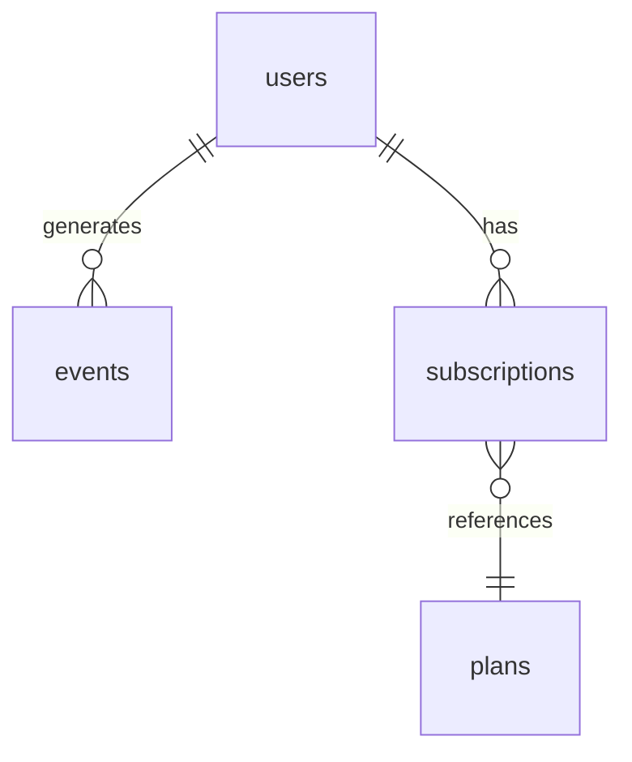

# My Document

**Database:** Database Name
**Schema:** Schema Name
**Last Updated:** YYYY-MM-DD

---

## Table: `users`

| Column | Type | Nullable | Description | Example |
|--------|------|----------|-------------|---------|
| `id` | UUID | No | Primary key | `550e8400-...` |
| `email` | VARCHAR(255) | No | User email, unique | `user@ex.com` |
| `created_at` | TIMESTAMP | No | Account creation | `2026-01-01T00:00:00Z` |
| `plan` | ENUM | No | Subscription tier | `free`, `pro`, `enterprise` |
| `is_active` | BOOLEAN | No | Account status | `true` |

## Table: `events`

| Column | Type | Nullable | Description | Example |
|--------|------|----------|-------------|---------|
| `id` | BIGINT | No | Auto-increment PK | `12345` |
| `user_id` | UUID | No | FK → users.id | |
| `event_name` | VARCHAR(100) | No | Event identifier | `page_view` |
| `properties` | JSONB | Yes | Event metadata | `{"page": "/home"}` |
| `timestamp` | TIMESTAMP | No | Event time (UTC) | |

## Relationships

## Notes

- All timestamps are UTC
- Soft deletes: `deleted_at` column where applicable
- PII columns are encrypted at rest
