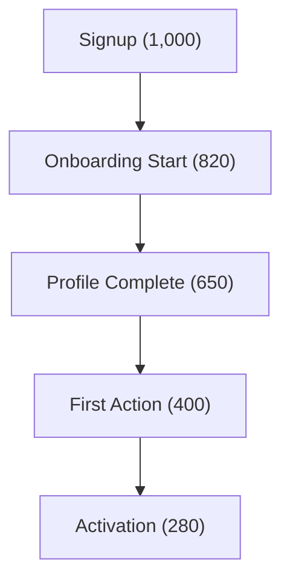

# My Document

**Funnel:** User Activation Funnel
**Period:** Last 30 days
**Date:** YYYY-MM-DD

---

## Funnel Visualization

## Conversion Table

| Step | Users | Conv. Rate | Drop-off |
|------|-------|-----------|----------|
| Signup | 1,000 | 100% | - |
| Onboarding Start | 820 | 82% | 18% |
| Profile Complete | 650 | 79% | 21% |
| First Action | 400 | 62% | 38% |
| Activation | 280 | 70% | 30% |

**Overall Conversion:** 28%

## Biggest Drop-offs

1. **Profile Complete → First Action** (38% drop-off)
   - Hypothesis: Users don't know what to do next
   - Action: Add guided first-action prompt
2. **Activation** (30% drop-off)
   - Hypothesis: Value not clear enough
   - Action: Redesign "aha moment" flow

## Recommendations

- [ ] Implement guided wizard after profile completion
- [ ] A/B test activation prompt copy
- [ ] Add progress indicator to onboarding
