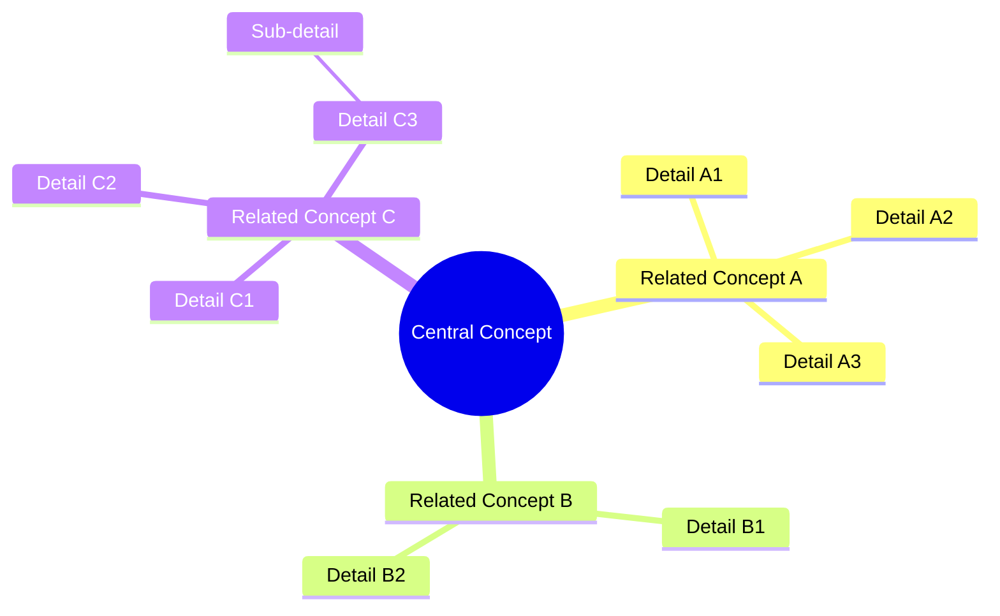

# My Document

**Subject:** Subject Name
**Date:** YYYY-MM-DD

---

## Concept Map

## Concept Definitions

| Concept | Definition | Example |
|---------|------------|---------|
| Central |            |         |
| A       |            |         |
| B       |            |         |
| C       |            |         |

## Relationships

- **A → B:** How A relates to B
- **B → C:** How B relates to C
- **C → A:** How C relates to A

## Key Takeaways

1. Takeaway 1
2. Takeaway 2
3. Takeaway 3
