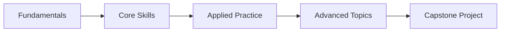

# My Document

**Goal:** What you want to learn
**Timeline:** X weeks
**Date:** YYYY-MM-DD

---

## Learning Path

## Modules

### Module 1: Fundamentals (Week 1-2)

- [ ] Resource 1 - book, course, or video
- [ ] Resource 2
- [ ] Practice exercise
- **Milestone:** Can explain [concept] clearly

### Module 2: Core Skills (Week 3-4)

- [ ] Resource 1
- [ ] Resource 2
- [ ] Build [small project]
- **Milestone:** Can [demonstrate skill]

### Module 3: Applied Practice (Week 5-6)

- [ ] Work through [real-world example]
- [ ] Contribute to open source / peer project
- **Milestone:** Portfolio piece complete

### Module 4: Advanced Topics (Week 7-8)

- [ ] Deep dive on [topic]
- [ ] Read [paper/article]
- **Milestone:** Can teach this to someone else

### Capstone

- [ ] Define project scope
- [ ] Build and ship
- [ ] Write retrospective
