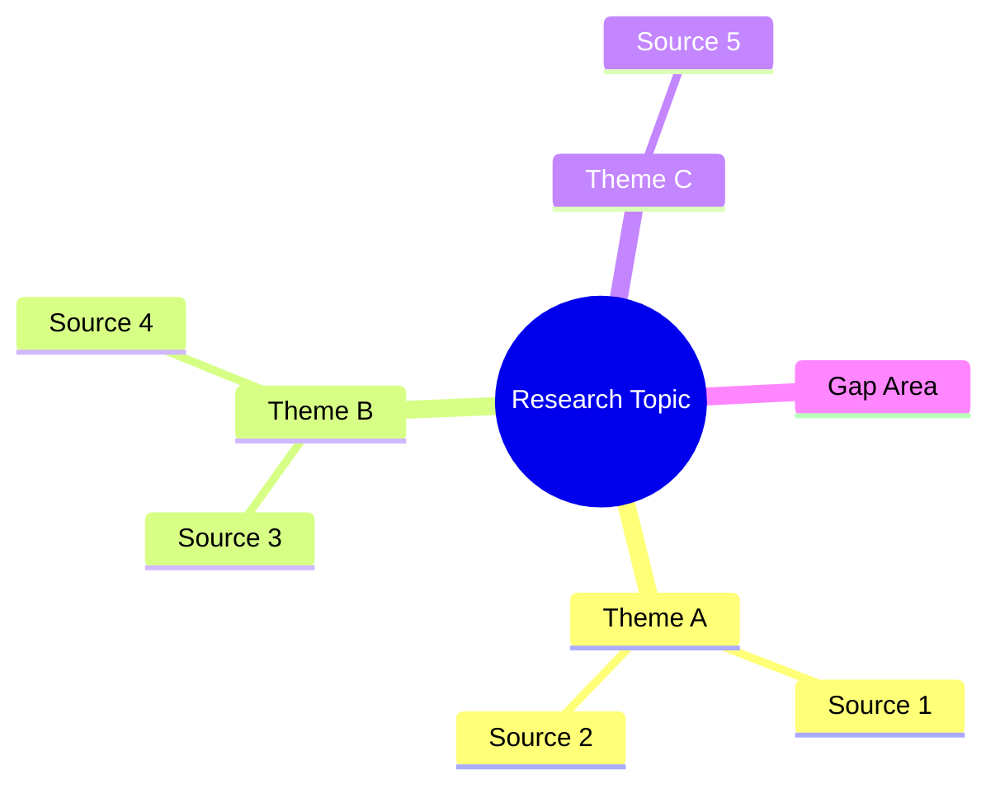

# My Document

**Research Question:** Your research question
**Date:** YYYY-MM-DD

---

## Conceptual Framework

## Theme A: Topic

### Source 1

**Author (Year):** Summary of findings and methodology.

### Source 2

**Author (Year):** Summary of findings.

**Connection:** How these sources relate to each other.

## Theme B: Topic

### Source 3

**Author (Year):** Summary of findings.

## Gap Analysis

What has not been adequately addressed?

| Gap | Why It Matters | Potential Approach |
|-----|----------------|-------------------|
|     |                |                   |

## Synthesis

How do these themes connect? What does the body of literature tell us?
