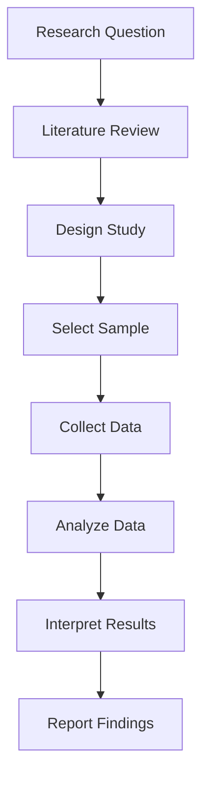

# My Document

**Study:** Study Title
**Researcher:** Your Name
**Date:** YYYY-MM-DD

---

## Research Design

- **Type:** Qualitative / Quantitative / Mixed Methods
- **Approach:** Experimental / Survey / Case Study / Ethnographic

## Research Flow

## Sampling

- **Population:** Describe the target population
- **Sample Size:** $n = $ ___
- **Sampling Method:** Random / Stratified / Convenience / Purposive

Sample size calculation:

$$
n = \frac{Z^2 \\cdot p(1-p)}{E^2}
$$

Where $Z$ = confidence level, $p$ = estimated proportion, $E$ = margin of error.

## Data Collection

| Method | Tool | Timeline | Responsible |
|--------|------|----------|-------------|
|        |      |          |             |

## Analysis Methods

- Descriptive statistics
- Method 2
- Method 3

## Validity & Reliability

- **Internal Validity:** How controlled is the study?
- **External Validity:** How generalizable are the results?
- **Reliability:** Can the study be replicated?

## Ethical Considerations

- [ ] IRB approval obtained
- [ ] Informed consent prepared
- [ ] Data anonymization planned
