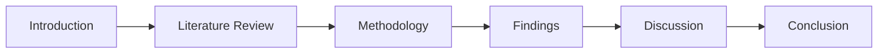
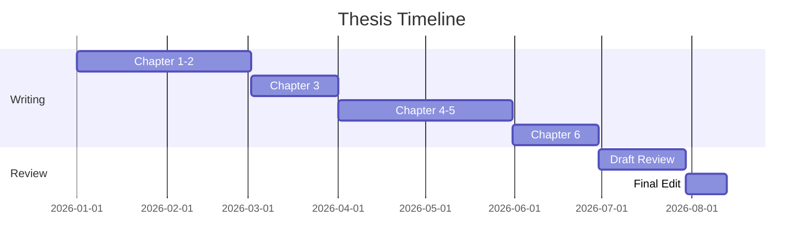

# Thesis Outline: My Document

**Author:** Your Name
**Advisor:** Advisor Name
**Program:** Department / University
**Expected Completion:** Date

---

## Argument Flow

## Chapter Outline

### Chapter 1: Introduction

- Research question
- Significance
- Scope and limitations

### Chapter 2: Literature Review

- Theme 1
- Theme 2
- Gap identification

### Chapter 3: Methodology

- Research design
- Data collection
- Analysis approach

### Chapter 4: Findings

- Finding 1
- Finding 2

### Chapter 5: Discussion

- Interpretation
- Implications
- Limitations

### Chapter 6: Conclusion

- Summary
- Recommendations
- Future research

## Timeline

## Bibliography Plan

- [ ] Collect all sources
- [ ] Format in required citation style
- [ ] Cross-reference all in-text citations
