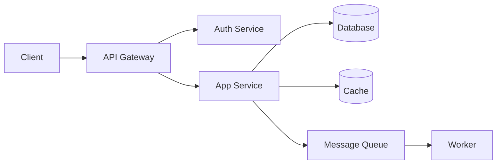

# Architecture: My Document

**Author:** Your Name
**Date:** YYYY-MM-DD

## System Overview

High-level description of what this system does.

## Architecture Diagram

## Components

### Component 1

- **Purpose:** What it does
- **Technology:** Stack used

### Component 2

- **Purpose:** What it does
- **Technology:** Stack used

## Data Flow

1. Request comes in from client
2. API validates and processes
3. Data is persisted to database
4. Response returned to client

## Technology Stack

| Layer      | Technology | Version |
|------------|-----------|---------|
| Frontend   |           |         |
| Backend    |           |         |
| Database   |           |         |

## Trade-offs & Decisions

- Decision 1: Why we chose X over Y
