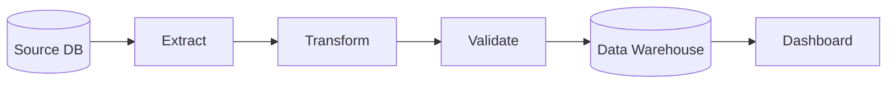

# My Document

**Pipeline:** Pipeline Name
**Owner:** Team Name
**Last Updated:** YYYY-MM-DD

---

## Pipeline Overview

## Schema Mapping

| Source Field | Source Type | Target Field | Target Type | Transform |
|-------------|------------|--------------|-------------|-----------|
|             |            |              |             |           |
|             |            |              |             |           |

## Schedule & SLA

| Property     | Value           |
|--------------|-----------------|
| Frequency    | Daily / Hourly  |
| Start Time   |                 |
| SLA          | < 2 hours       |
| Data Freshness |               |

## Monitoring & Alerts

| Alert | Condition | Severity | Notification |
|-------|-----------|----------|--------------|
|       | Failure   | P0       | PagerDuty    |
|       | Latency   | P1       | Slack        |
|       | Data Quality | P2    | Email        |

## Error Handling

- **Retry policy:** 3 retries with exponential backoff
- **Dead letter queue:** Yes / No
- **Manual intervention:** When to escalate
