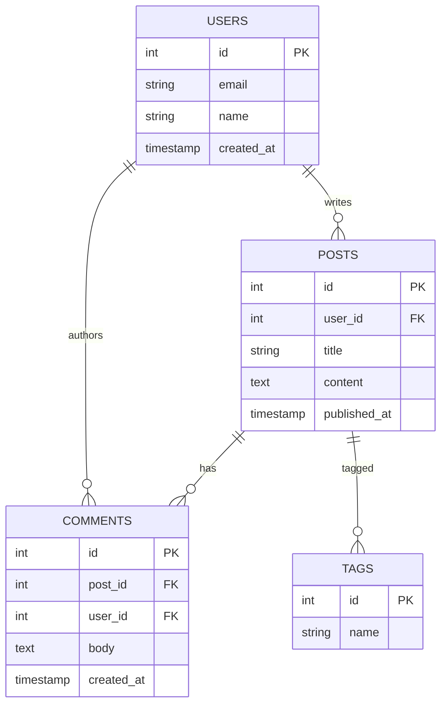

# My Document

**Database:** Database Name
**Engine:** PostgreSQL / MySQL / SQLite
**Last Updated:** YYYY-MM-DD

---

## Entity Relationship Diagram

## Tables

### users

| Column     | Type       | Nullable | Default | Notes        |
|------------|------------|----------|---------|--------------|
| id         | INT        | NO       | AUTO    | Primary key  |
| email      | VARCHAR    | NO       |         | Unique index |
| name       | VARCHAR    | YES      |         |              |
| created_at | TIMESTAMP  | NO       | NOW()   |              |

## Indexes

| Table | Index Name       | Columns | Type   |
|-------|------------------|---------|--------|
| users | idx_users_email  | email   | UNIQUE |
| posts | idx_posts_user   | user_id | BTREE  |

## Migration Notes

- [ ] Create tables
- [ ] Add indexes
- [ ] Seed initial data
- [ ] Backfill existing records
