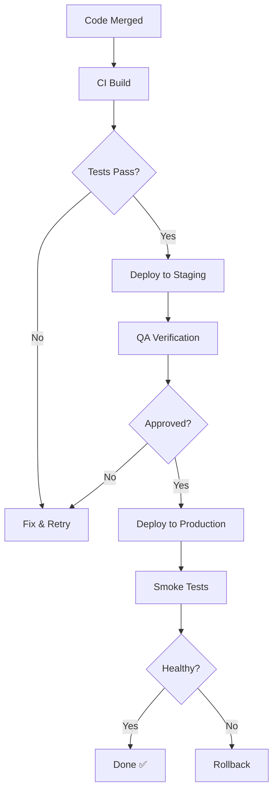

# My Document

**Service:** Service Name
**Last Updated:** YYYY-MM-DD
**Owner:** Team Name

---

## Deployment Flow



## Environment Configuration

| Setting         | Staging              | Production           |
|-----------------|----------------------|----------------------|
| URL             |                      |                      |
| Database        |                      |                      |
| API Key         |                      |                      |
| Feature Flags   |                      |                      |

## Pre-Deploy Checklist

- [ ] All tests passing
- [ ] Changelog updated
- [ ] Database migrations ready
- [ ] Rollback plan documented
- [ ] On-call engineer notified

## Deploy Commands

```bash
# Staging
./deploy.sh --env staging

# Production
./deploy.sh --env production
```

## Rollback Procedure

1. Identify the issue
2. Run `./rollback.sh --to <previous-version>`
3. Verify health checks
4. Notify team in #deployments
