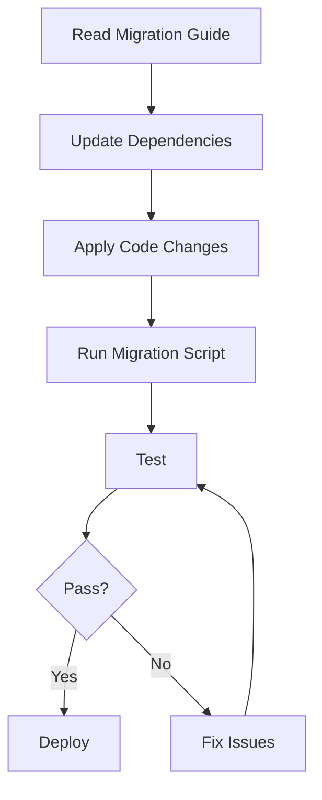

# My Document

**From:** v1.x
**To:** v2.0
**Date:** YYYY-MM-DD

---

## Overview

Summary of what changed and why migration is needed.

## Migration Flow



## Breaking Changes

| Change | Before (v1) | After (v2) | Action Required |
|--------|-------------|------------|-----------------|
|        | `old_api()` | `new_api()` | Find & replace |
|        |             |            |                 |

## Step-by-Step Migration

### Step 1: Update Dependencies

```bash
npm install package@^2.0.0
```

### Step 2: Update Configuration

```diff
- old_config_key: value
+ new_config_key: value
```

### Step 3: Update Code

Replace deprecated API calls.

### Step 4: Run Migration Script

```bash
npx migrate --from v1 --to v2
```

## FAQ

**Q: Can I migrate incrementally?**
A: Yes, see the incremental migration section.

**Q: Is there a rollback path?**
A: Yes, run `npx migrate --rollback`.
