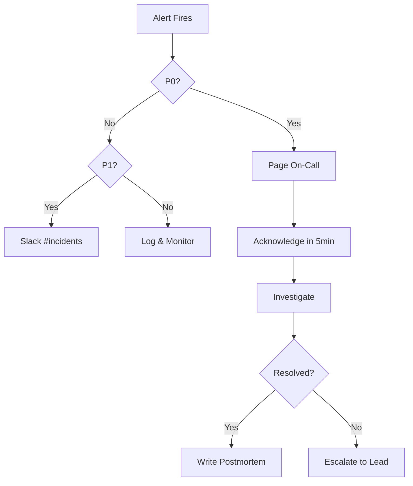

# My Document

**Service:** Service Name
**Owner:** Team Name
**Last Updated:** YYYY-MM-DD

---

## Escalation Flow

## Alert Definitions

| Alert | Condition | Severity | Action |
|-------|-----------|----------|--------|
| High Error Rate | >5% 5xx in 5min | P0 | Page on-call |
| Latency Spike | p99 >2s for 10min | P1 | Investigate |
| Disk Usage | >85% | P2 | Scale storage |
| Certificate Expiry | <30 days | P2 | Renew cert |

## Dashboard Links

- [Service Dashboard](https://example.com/dashboard)
- [Error Tracking](https://example.com/errors)
- [Logs](https://example.com/logs)

## On-Call Rotation

| Week | Primary | Secondary |
|------|---------|-----------|
| Current |      |           |
| Next    |      |           |

## Common Issues & Fixes

### High Memory Usage

1. Check for memory leaks: `kubectl top pods`
2. Restart affected pod: `kubectl rollout restart`
3. If recurring, file a bug
