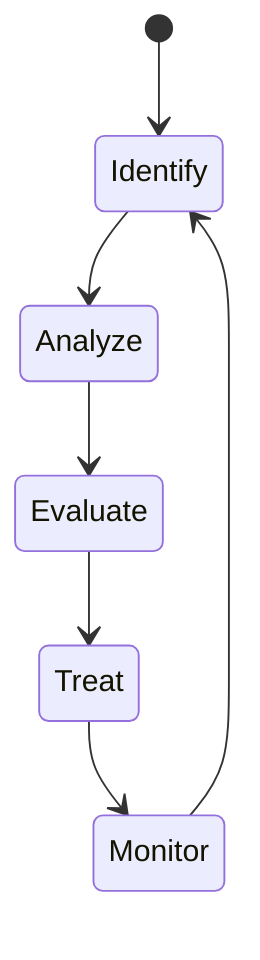

# My Document

**System:** System Name
**Auditor:** Your Name
**Date:** YYYY-MM-DD
**Classification:** Internal / External

---

## Threat Model

## Vulnerability Assessment

| ID | Vulnerability | Severity | CVSS | Status | Remediation |
|----|---------------|----------|------|--------|-------------|
| V1 |               | Critical | 9.0  | Open   |             |
| V2 |               | High     | 7.5  | Open   |             |
| V3 |               | Medium   | 5.0  | Fixed  |             |
| V4 |               | Low      | 2.0  | Accept |             |

## Authentication & Access

- [ ] MFA enabled for all admin accounts
- [ ] API keys rotated within policy window
- [ ] Least-privilege access enforced
- [ ] Unused accounts deactivated

## Data Protection

- [ ] Data encrypted at rest
- [ ] Data encrypted in transit (TLS)
- [ ] PII handling compliant with policy
- [ ] Backup and recovery tested

## Remediation Plan

| Priority | Action | Owner | Deadline | Status |
|----------|--------|-------|----------|--------|
| P0       |        |       |          |        |
| P1       |        |       |          |        |
| P2       |        |       |          |        |
