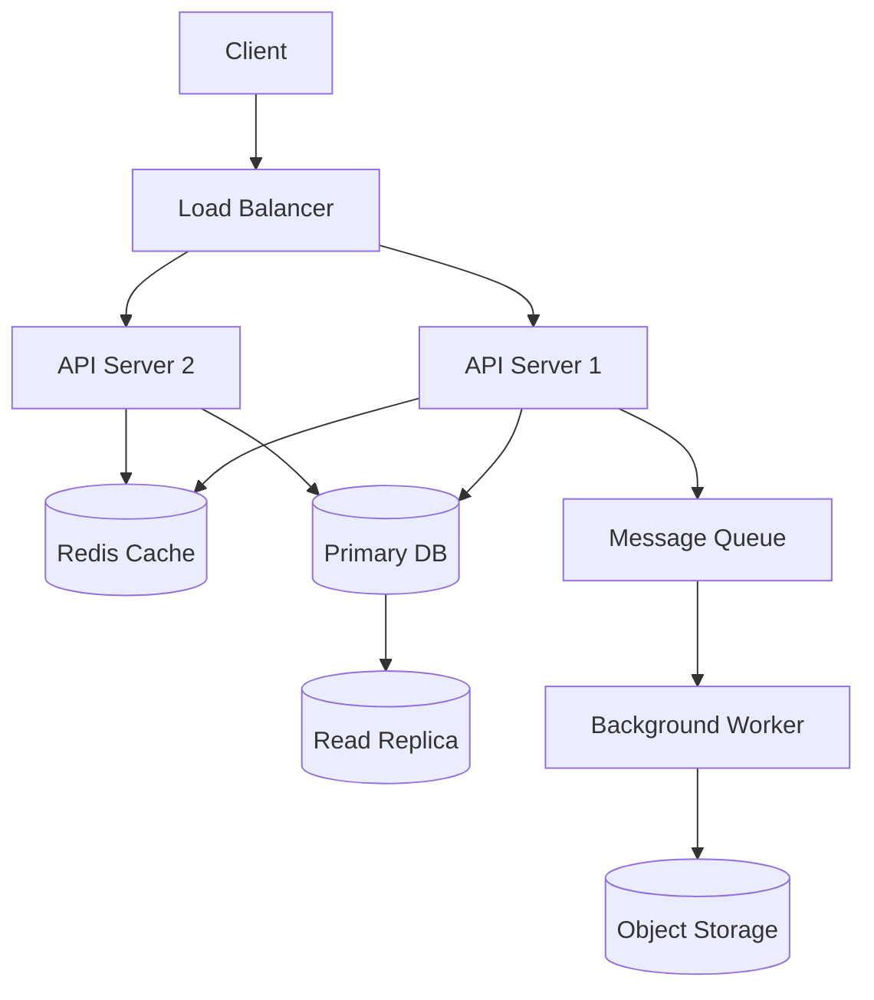
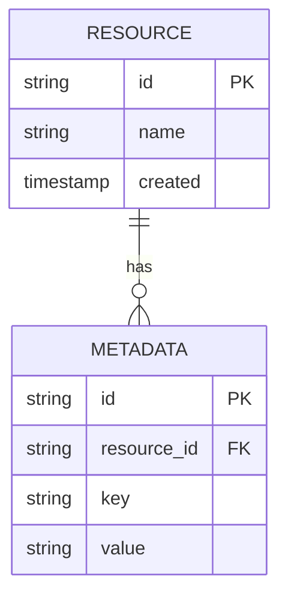

# My Document

**Author:** Your Name
**Date:** YYYY-MM-DD
**Status:** Draft | In Review | Approved

---

## 1. Requirements

### Functional

- Requirement 1
- Requirement 2

### Non-Functional

- Latency: < 200ms p99
- Availability: 99.9%
- Throughput: 10K req/s

## 2. Capacity Estimates

Daily active users: $N = 1,000,000$

$$
QPS = \frac{N \\times R}{86400} = \frac{1{,}000{,}000 \\times 10}{86400} \\approx 116
$$

Storage per year:

$$
S = N \\times D \\times 365 = 1{,}000{,}000 \\times 5\\text{KB} \\times 365 \\approx 1.8\\text{TB}
$$

## 3. Architecture



## 4. API Design

### `POST /api/resource`

```json
{
  "field1": "value",
  "field2": 123
}
```

### `GET /api/resource/:id`

Response: `200 OK`

## 5. Data Model



## 6. Trade-offs

| Decision | Option A | Option B | Chosen | Reason |
|----------|----------|----------|--------|--------|
|          |          |          |        |        |

## 7. Open Questions

- Question 1?
- Question 2?
