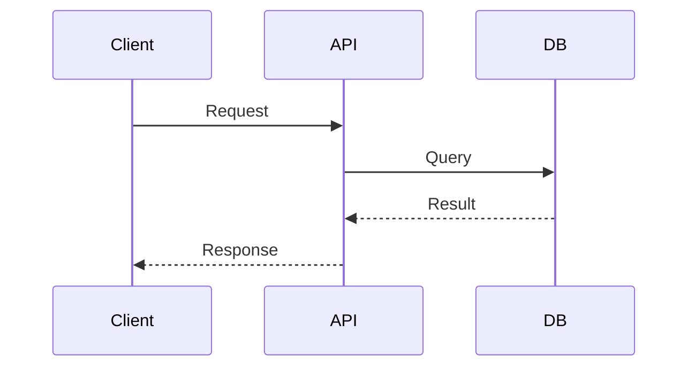

# Technical Spec: My Document

**Author:** Your Name
**Date:** YYYY-MM-DD
**Status:** Draft | In Review | Approved

## Problem

What problem are we solving? Why now?

## Goals & Non-Goals

### Goals
- Goal 1
- Goal 2

### Non-Goals
- Non-goal 1

## Proposed Design

Describe the technical approach.

### Architecture

High-level architecture description.

### Sequence Diagram



### Data Model

```
// Schema or data structures
```

## Alternatives Considered

| Approach   | Pros          | Cons          |
|------------|---------------|---------------|
| Option A   |               |               |
| Option B   |               |               |

## Implementation Plan

1. Step 1
2. Step 2
3. Step 3

## Testing Plan

- Unit tests for X
- Integration tests for Y

## Open Questions

- Question 1?
