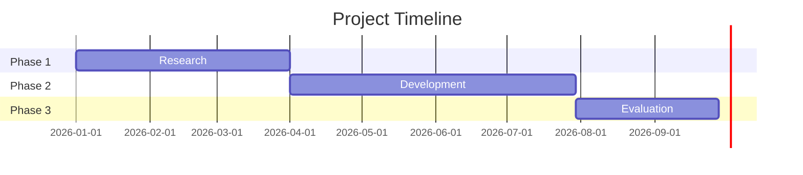

# My Document

**Organization:** Your Organization
**PI / Lead:** Your Name
**Date:** YYYY-MM-DD
**Funding Agency:** Agency Name

---

## Abstract

Summarize the project in 250 words or less.

## Statement of Need

What problem exists? Who is affected? Why is action needed now?

## Objectives

1. Objective 1
2. Objective 2
3. Objective 3

## Methodology

How will you achieve the objectives?

## Timeline

## Budget

| Category        | Amount    |
|-----------------|-----------|
| Personnel       |           |
| Equipment       |           |
| Travel          |           |
| Supplies        |           |
| Indirect Costs  |           |
| **Total**       |           |

The total cost is:

$$
C_{total} = C_{personnel} + C_{equipment} + C_{travel} + C_{supplies} + C_{indirect}
$$

## Expected Outcomes

What will success look like? How will impact be measured?

## References

1. Citation 1
2. Citation 2
