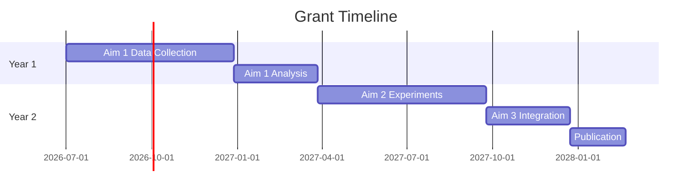

# My Document

**Agency:** Funding Agency
**Deadline:** Date
**PI:** Your Name
**Budget:** $___

---

## Specific Aims

Briefly state the goals and objectives.

**Aim 1:** What and why

**Aim 2:** What and why

**Aim 3:** What and why

## Significance

Why is this research important? What gap does it fill?

## Innovation

What is novel about this approach?

## Approach

### Aim 1: Methods

- Study design
- Sample size and power calculation
- Analysis plan

### Aim 2: Methods

- Experimental design
- Controls
- Data collection

## Timeline

## Budget Summary

| Category | Year 1 | Year 2 | Total |
|----------|--------|--------|-------|
| Personnel | | | |
| Equipment | | | |
| Supplies | | | |
| Travel | | | |
| **Total** | | | |
