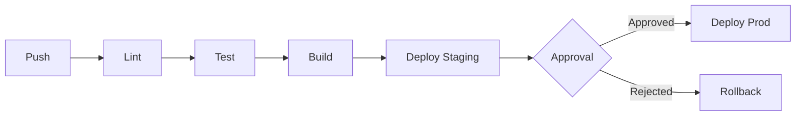

# My Document

**Platform:** GitHub Actions / GitLab CI / Jenkins
**Last Updated:** YYYY-MM-DD

---

## Pipeline Flow

## Stages

| Stage | Trigger | Duration | Artifacts |
|-------|---------|----------|-----------|
| Lint | Every push | ~1 min | - |
| Test | Every push | ~5 min | Coverage report |
| Build | main branch | ~3 min | Docker image |
| Deploy Staging | main branch | ~2 min | - |
| Deploy Prod | Manual approval | ~2 min | - |

## Environment Promotion

| Environment | Branch | URL | Auto-deploy |
|-------------|--------|-----|-------------|
| Dev | `feature/*` | dev.app.com | Yes |
| Staging | `main` | staging.app.com | Yes |
| Production | `main` + approval | app.com | No |

## Secrets

| Secret | Scope | Rotation |
|--------|-------|----------|
| `DOCKER_TOKEN` | Build | 90 days |
| `AWS_ACCESS_KEY` | Deploy | 30 days |
| `DATABASE_URL` | Deploy | As needed |

## Rollback Procedure

1. Identify failing deployment
2. Trigger rollback to previous image tag
3. Verify service health
4. Create incident report
