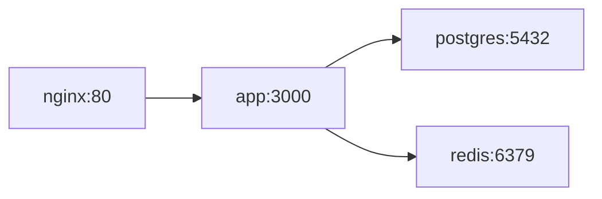

# My Document

**Project:** Project Name
**Last Updated:** YYYY-MM-DD

---

## Architecture



## docker-compose.yml Overview

| Service | Image | Port | Depends On |
|---------|-------|------|------------|
| app | `./Dockerfile` | 3000 | postgres, redis |
| postgres | `postgres:16` | 5432 | - |
| redis | `redis:7-alpine` | 6379 | - |
| nginx | `nginx:alpine` | 80 → 3000 | app |

## Environment Variables

| Variable | Service | Default | Description |
|----------|---------|---------|-------------|
| `DATABASE_URL` | app | - | Postgres connection string |
| `REDIS_URL` | app | `redis://redis:6379` | Redis connection |
| `POSTGRES_PASSWORD` | postgres | - | DB password |

## Common Commands

```bash
# Start all services
docker compose up -d

# View logs
docker compose logs -f app

# Rebuild after code changes
docker compose up -d --build app

# Reset database
docker compose down -v && docker compose up -d
```

## Volumes

| Volume | Mount | Purpose |
|--------|-------|---------|
| `pgdata` | `/var/lib/postgresql/data` | Persist DB |
| `./src` | `/app/src` | Dev hot reload |
