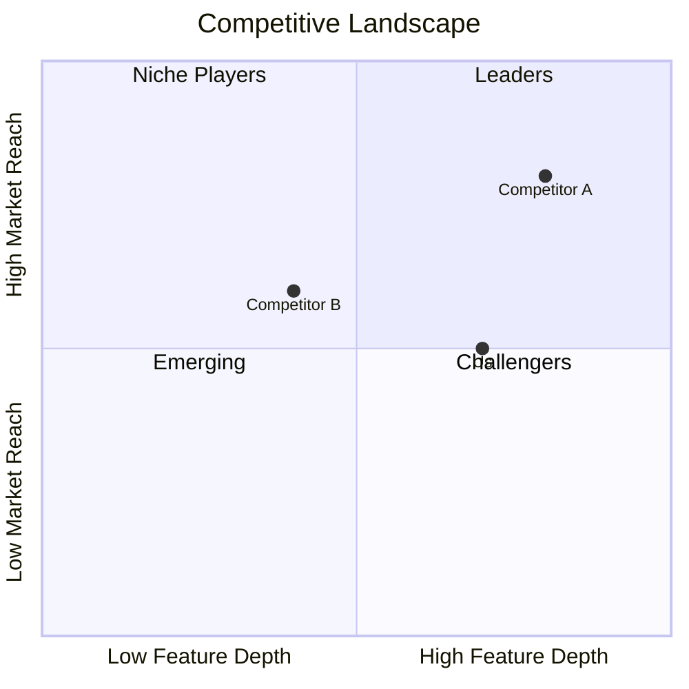

# My Document

**Market:** Market Name
**Date:** YYYY-MM-DD

---

## Competitor Profiles

### Competitor A

- **Website:** example.com
- **Founded:** Year
- **Positioning:** Brief description
- **Strengths:** Key advantages
- **Weaknesses:** Key gaps

### Competitor B

- **Website:** example.com
- **Founded:** Year
- **Positioning:** Brief description
- **Strengths:** Key advantages
- **Weaknesses:** Key gaps

## Feature Comparison

| Feature        | Us | Comp A | Comp B | Comp C |
|----------------|----|--------|--------|--------|
| Feature 1      | ✅ | ✅     | ❌     | ✅     |
| Feature 2      | ✅ | ❌     | ✅     | ❌     |
| Feature 3      | ✅ | ✅     | ✅     | ❌     |
| Pricing        |    |        |        |        |

## Market Position

## Our Differentiation

What makes us uniquely positioned?
