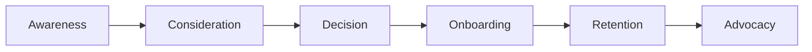

# My Document

**Persona:** Persona Name
**Date:** YYYY-MM-DD

---

## Journey Stages

## Stage Details

| Stage | Touchpoints | Emotions | Pain Points | Opportunities |
|-------|-------------|----------|-------------|---------------|
| Awareness | Social, blog, ads | Curious | Doesn't know us | SEO, content |
| Consideration | Website, demo | Interested | Comparing options | Case studies |
| Decision | Pricing, trial | Anxious | Fear of commitment | Free trial |
| Onboarding | Email, docs | Overwhelmed | Learning curve | Guided setup |
| Retention | Product, support | Satisfied | Feature gaps | Product updates |
| Advocacy | Community | Loyal | No easy way to share | Referral program |

## Key Moments of Truth

1. First visit to website → Does the value prop land in 5 sec?
2. First time using the product → Do they reach "aha" moment?
3. First support interaction → Fast and helpful?

## Action Items

- [ ] Improve onboarding flow
- [ ] Create case study library
- [ ] Build referral program
