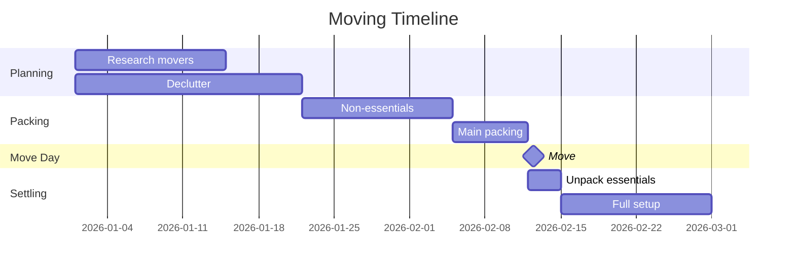

# My Document

**Moving From:** Current Address
**Moving To:** New Address
**Moving Date:** Date

---

## Timeline

## 📦 Room Inventory

| Room | Boxes | Special Items | Notes |
|------|-------|---------------|-------|
| Kitchen |   |               |       |
| Bedroom |   |               |       |
| Living Room | |             |       |
| Office  |   |               |       |
| Bathroom |  |               |       |

## 🔧 Utilities Transfer

| Utility | Cancel at Old | Setup at New | Status |
|---------|---------------|-------------|--------|
| Electric |              |             | [ ]    |
| Gas     |               |             | [ ]    |
| Internet |              |             | [ ]    |
| Water   |               |             | [ ]    |

## 📬 Address Change

- [ ] Post office mail forwarding
- [ ] Bank & credit cards
- [ ] Insurance policies
- [ ] Employer / Payroll
- [ ] Subscriptions
- [ ] DMV / Driver's license
- [ ] Voter registration
