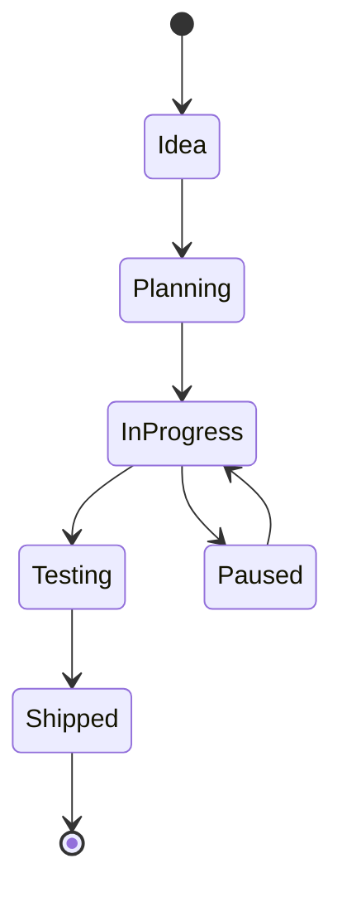

# My Document

**Last Updated:** YYYY-MM-DD

---

## Project Status

## Projects

| Project | Status | Started | Last Touched | Priority |
|---------|--------|---------|-------------|----------|
|         | 🔵 In Progress |  |             | High     |
|         | 🟡 Paused |      |             | Medium   |
|         | 💡 Idea  |       |             | Low      |

## Current Focus: Project Name

### This Week

- [ ] Task 1
- [ ] Task 2
- [ ] Task 3

### Milestones

| Milestone | Target Date | Status |
|-----------|------------|--------|
| MVP       |            |        |
| Beta      |            |        |
| Launch    |            |        |

### Lessons Learned

- Lesson 1
- Lesson 2
