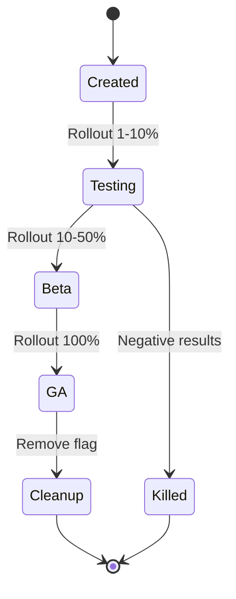

# My Document

**Last Updated:** YYYY-MM-DD

---

## Active Flags

| Flag Name | Owner | Created | Rollout | Status | Cleanup By |
|-----------|-------|---------|---------|--------|------------|
| `new_onboarding` | @pm | 2026-01-15 | 100% | ✅ Ship | 2026-02-15 |
| `dark_mode_v2` | @design | 2026-02-01 | 50% | 🔵 Testing | - |
| `ai_suggestions` | @ml | 2026-03-01 | 10% | 🟡 Beta | - |
| `pricing_v3` | @growth | 2026-01-20 | 0% | ⬜ Kill switch | 2026-02-01 |

## Flag Lifecycle

## Cleanup Queue

| Flag | Rolled Out | Owner | Cleanup PR | Status |
|------|-----------|-------|-----------|--------|
| `new_onboarding` | 2026-01-30 | @pm | | ⬜ Pending |

## Rules

- All flags must have an owner and cleanup date
- Flags at 100% for > 2 weeks should be cleaned up
- Maximum active flags: 15
