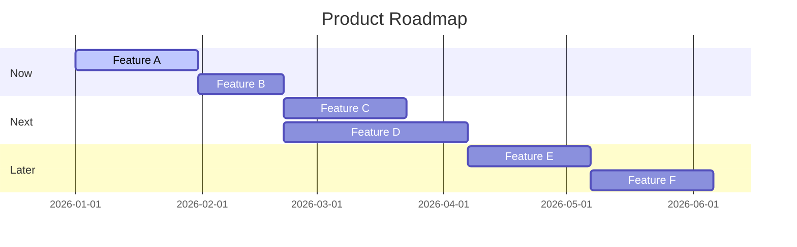

# My Document

**Product:** Product Name
**Last Updated:** YYYY-MM-DD

---

## Roadmap Timeline

## Now (This Quarter)

| Feature | Owner | Status | Target |
|---------|-------|--------|--------|
| Feature A | @name | 🔵 In Progress | Jan 30 |
| Feature B | @name | ⬜ Not Started | Feb 21 |

## Next (Next Quarter)

| Feature | Owner | Status | Dependencies |
|---------|-------|--------|-------------|
| Feature C | TBD | 💡 Planned | Feature A |
| Feature D | TBD | 💡 Planned | None |

## Later (Backlog)

- Feature E - brief description
- Feature F - brief description

## Themes

| Theme | Goal | Features |
|-------|------|----------|
| Growth | Increase activation | A, B |
| Retention | Reduce churn | C, D |
| Platform | Technical foundation | E, F |
