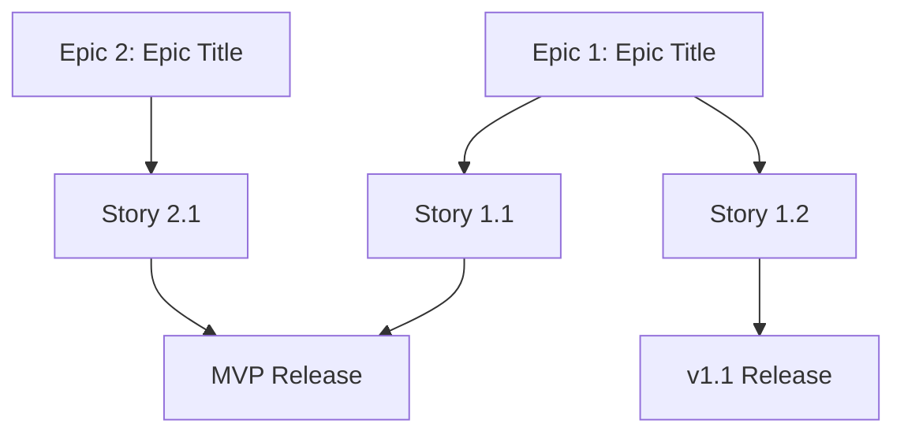

# User Story Map: My Document

**Product:** Product Name
**Date:** YYYY-MM-DD

---

## Epic 1: Epic Title

### User Story 1.1

**As a** [user type],
**I want** [goal],
**so that** [benefit].

**Acceptance Criteria:**
- [ ] Given X, when Y, then Z
- [ ] Given A, when B, then C

**Priority:** High
**Estimate:** X points

### User Story 1.2

**As a** [user type],
**I want** [goal],
**so that** [benefit].

**Acceptance Criteria:**
- [ ] Criteria 1

**Priority:** Medium
**Estimate:** X points

## Epic 2: Epic Title

### User Story 2.1

**As a** [user type],
**I want** [goal],
**so that** [benefit].

**Acceptance Criteria:**
- [ ] Criteria 1

**Priority:** High
**Estimate:** X points

## Story Map Overview

## Release Plan

| Release | Stories      | Target Date |
|---------|-------------|-------------|
| MVP     | 1.1, 2.1    |             |
| v1.1    | 1.2         |             |
