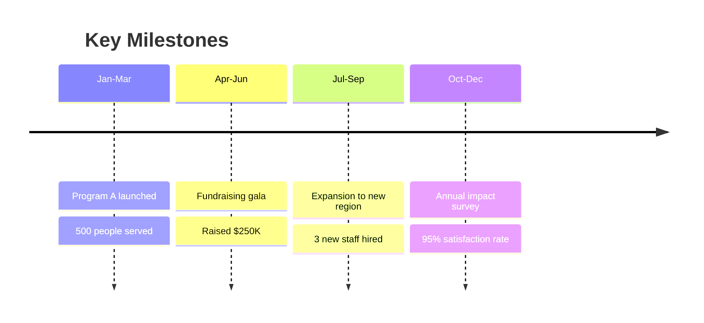

# My Document - 2025

**Organization:** Organization Name

---

## Letter from the Director

Short personal message about the year's achievements and gratitude.

## Year in Review

## Impact Summary

| Metric | 2026 | 2025 | Growth |
|--------|------|------|--------|
| People Served | | | +X% |
| Programs | | | +X |
| Volunteers | | | +X% |
| Revenue | $ | $ | +X% |

## Financial Summary

| | Revenue | Expenses |
|---|---------|---------|
| Programs | $ | $ |
| Fundraising | $ | $ |
| Admin | - | $ |
| **Total** | **$** | **$** |
| **Net** | | **$** |

## Donors & Supporters

Thank you to our generous supporters:

**$10,000+:** Donor A, Donor B
**$5,000+:** Donor C, Donor D
**$1,000+:** Donor E, Donor F, Donor G

## Looking Ahead to 2026

Key goals and initiatives for the coming year.
