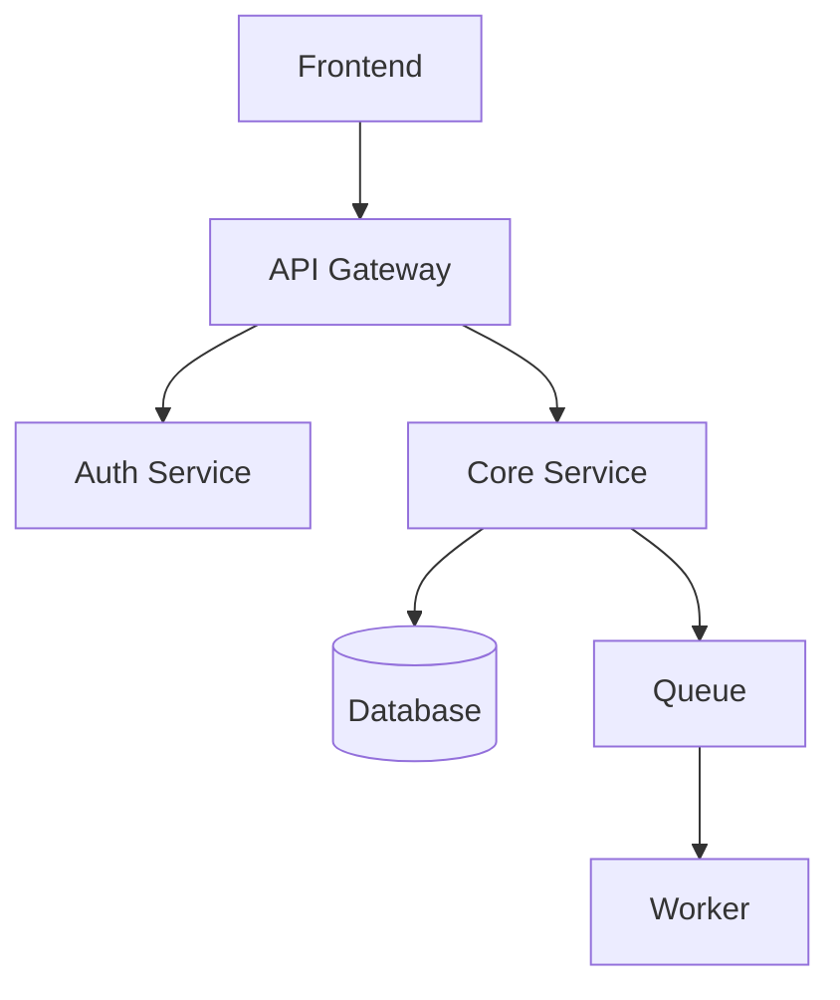

# My Document

**From:** Your Name
**To:** Successor Name
**Date:** YYYY-MM-DD
**Effective:** Handoff Date

---

## Context

Brief description of the project/role and its current state.

## System Overview

## Current State

- **What's working:** Summary
- **Known issues:** Summary
- **In progress:** Summary

## Pending Items

| Item | Priority | Status | Notes |
|------|----------|--------|-------|
|      | High     |        |       |
|      | Medium   |        |       |
|      | Low      |        |       |

## Key Contacts

| Person | Role | When to Contact |
|--------|------|-----------------|
|        |      |                 |
|        |      |                 |

## Access & Credentials

- [ ] Repo access transferred
- [ ] Dashboard access granted
- [ ] API keys documented
- [ ] On-call rotation updated

## Open Risks

- Risk 1 - Mitigation
- Risk 2 - Mitigation
