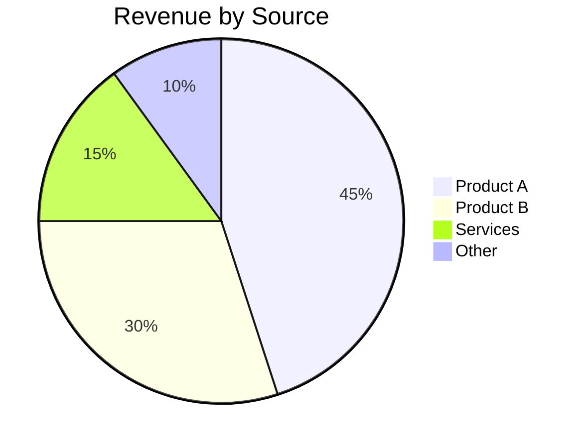
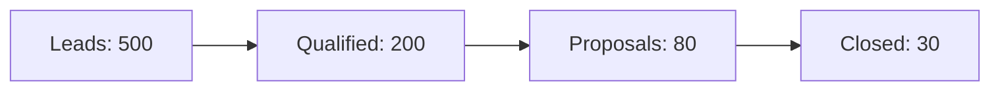

# Quarterly Business Review - Month YYYY

**Presenter:** Your Name
**Quarter:** Q1 / Q2 / Q3 / Q4

---

## Executive Summary

One paragraph summarizing the quarter.

## KPI Dashboard

| Metric          | Target | Actual | Delta   |
|-----------------|--------|--------|---------|
| Revenue         |        |        |         |
| New Customers   |        |        |         |
| Churn Rate      |        |        |         |
| NPS             |        |        |         |

## Revenue Breakdown

## Pipeline

Conversion rate:

$$
CR = \frac{Closed}{Leads} \\times 100 = \frac{30}{500} \\times 100 = 6\\%
$$

## Strategic Priorities - Next Quarter

1. Priority 1
2. Priority 2
3. Priority 3

## Action Items

- [ ] @name - Action item 1
- [ ] @name - Action item 2
