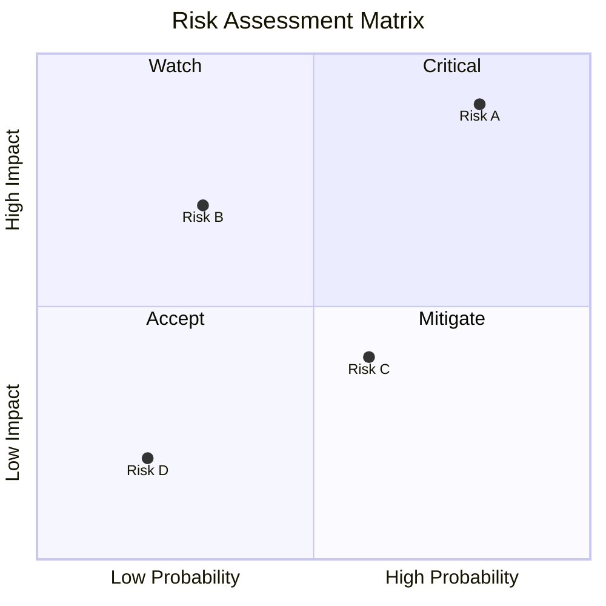

# My Document

**Project:** Project Name
**Date:** YYYY-MM-DD
**Owner:** Your Name

---

## Risk Matrix

## Risk Register

| ID | Risk | Probability | Impact | Score | Mitigation | Owner | Status |
|----|------|-------------|--------|-------|------------|-------|--------|
| R1 |      | High        | High   | 🔴   |            |       | Open   |
| R2 |      | Medium      | High   | 🟡   |            |       | Open   |
| R3 |      | Low         | Medium | 🟢   |            |       | Open   |

## Contingency Plans

### R1 - If this risk materializes

- Immediate action:
- Escalation path:
- Recovery plan:
