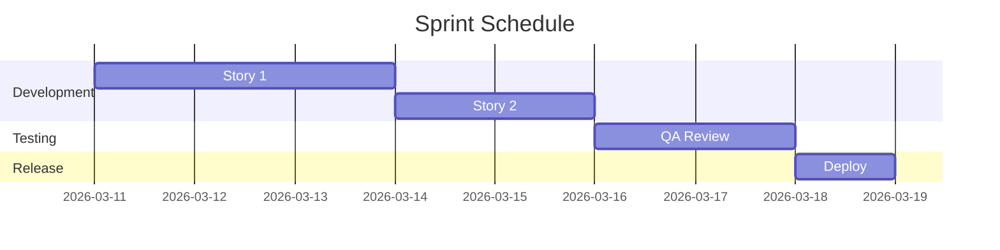

# Sprint Planning - YYYY-MM-DD

**Sprint:** Sprint #
**Duration:** 2 weeks
**Sprint Goal:**

---

## Team Capacity

| Team Member | Available Days | Notes      |
|-------------|----------------|------------|
| @name1      | 10             |            |
| @name2      | 8              | PTO Friday |

## Committed Stories

| Story | Points | Owner  | Status   |
|-------|--------|--------|----------|
|       |        |        | To Do    |
|       |        |        | To Do    |

## Sprint Timeline

## Carryover from Last Sprint

- Story 1 - Reason for carryover

## Risks & Dependencies

- Risk 1
- Dependency on Team X
