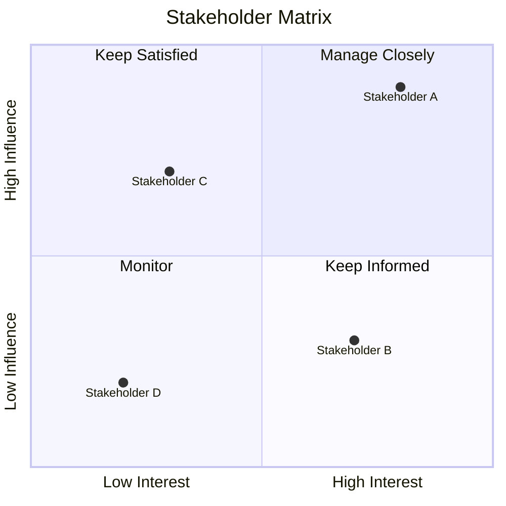

# My Document

**Project:** Project Name
**Date:** YYYY-MM-DD

---

## Stakeholder List

| Stakeholder | Role | Interest | Influence | Strategy |
|-------------|------|----------|-----------|----------|
| Name 1      |      | High     | High      | Manage closely |
| Name 2      |      | High     | Low       | Keep informed |
| Name 3      |      | Low      | High      | Keep satisfied |
| Name 4      |      | Low      | Low       | Monitor |

## Influence-Interest Matrix

## Communication Plan

| Stakeholder | Method | Frequency | Owner |
|-------------|--------|-----------|-------|
|             |        |           |       |
