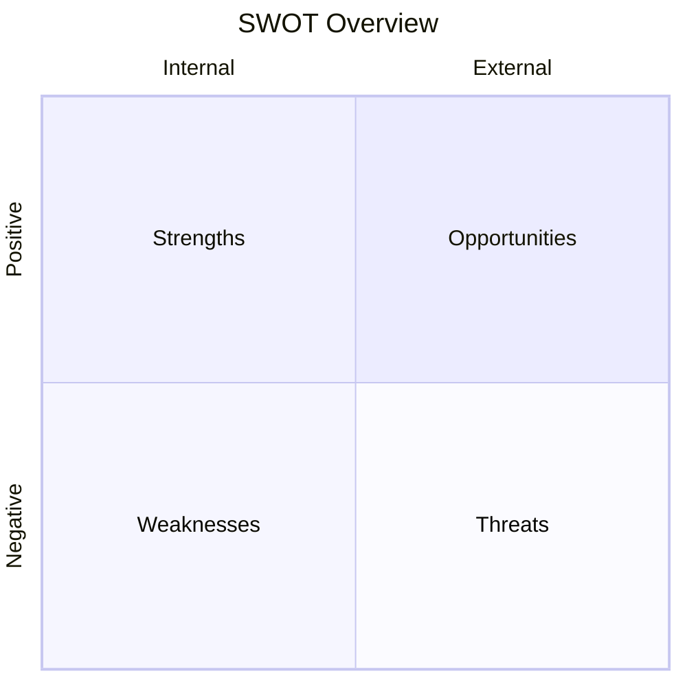

# SWOT Analysis: My Document

**Date:** YYYY-MM-DD

---

## Strengths (Internal, Positive)

- Strength 1
- Strength 2
- Strength 3

## Weaknesses (Internal, Negative)

- Weakness 1
- Weakness 2
- Weakness 3

## Opportunities (External, Positive)

- Opportunity 1
- Opportunity 2
- Opportunity 3

## Threats (External, Negative)

- Threat 1
- Threat 2
- Threat 3

## Summary Matrix

## Strategic Actions

- **S-O:** Use strengths to pursue opportunities
- **W-O:** Improve weaknesses to capture opportunities
- **S-T:** Use strengths to mitigate threats
- **W-T:** Address weaknesses to avoid threats
