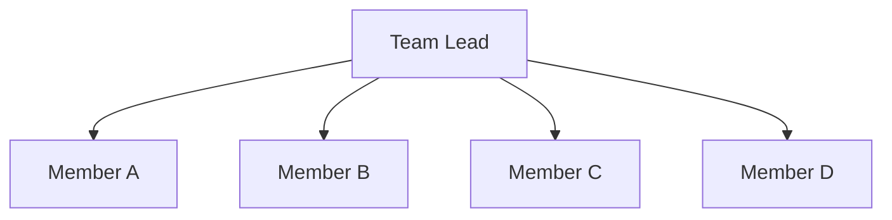

# My Document

**Team:** Team Name
**Created:** YYYY-MM-DD

---

## Mission

Why does this team exist? What is our purpose?

## Team Structure

| Name | Role | Responsibilities |
|------|------|-----------------|
|      | Lead |                 |
|      |      |                 |
|      |      |                 |

## Working Norms

- **Core hours:** 10am - 4pm
- **Standups:** Daily at X
- **Retros:** Biweekly
- **Communication:** Slack for quick, email for formal

## Decision-Making Process

How we make decisions (consensus, majority, lead decides after input).

## Conflict Resolution

1. Discuss directly with the person
2. Escalate to team lead
3. Involve skip-level if unresolved

## Communication Plan

| Channel | Purpose | Frequency |
|---------|---------|-----------|
| Slack   | Day-to-day | Ongoing |
| Email   | Decisions  | As needed |
| Meeting | Sync       | Weekly |
