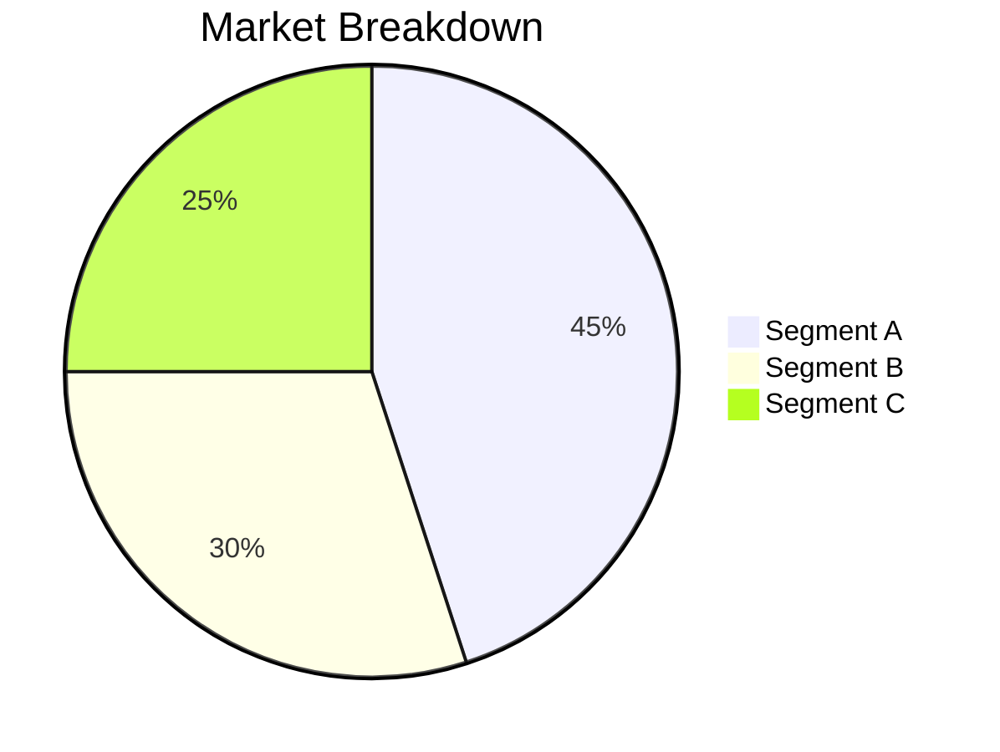

# My Document

**Author:** Your Name
**Date:** YYYY-MM-DD
**Organization:** Company Name

---

## Abstract

A concise summary of the problem, approach, and key findings (150-250 words).

## 1. Introduction

What problem does this paper address? Why does it matter now?

## 2. Background

Existing approaches, market context, and relevant data.

## 3. Analysis

### Key Metrics

The growth rate can be modeled as:

$$
G = \frac{R_{t} - R_{t-1}}{R_{t-1}} \\times 100
$$

## 4. Methodology

How was the research conducted? What data sources were used?

## 5. Findings

| Finding | Impact | Confidence |
|---------|--------|------------|
|         |        |            |
|         |        |            |

## 6. Recommendations

1. Recommendation 1
2. Recommendation 2
3. Recommendation 3

## 7. Conclusion

Summarize key takeaways and next steps.

## References

1. Source 1
2. Source 2
